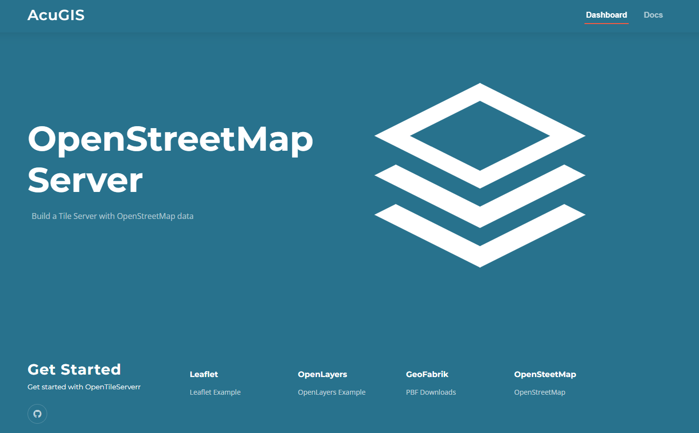

# OpenStreetMap Server

## Build an OpenStreetMap Server

* Project page: https://www.acugis.com/opentileserver
* Documentation: https://www.acugis.com/opentileserver/docs

Installation Options

### 1. [Script](https://github.com/AcuGIS/OpenTileServer/blob/master/README.md#1-script)
### 2. [Docker Compose](https://github.com/AcuGIS/OpenTileServer/blob/master/README.md#2-install-using-docker-compose)

This script is for building a basic tile server with OpenStreetMap data.

## 1.  Install Using Script

For demos to work, be sure your hostname is set properly.

On a clean Ubuntu 22 install.

1. Get the script and make it executable:

    wget https://raw.githubusercontent.com/AcuGIS/OpenTileServer/master/opentileserver-ubuntu-22.sh && chmod +x opentileserver-ubuntu-22.sh

2. If using a non-Latin alphabet, ucomment line 24 below:

    export LC_ALL=C      

3.  Run the script

### Running the script:

    ./opentileserver-ubuntu-22.sh  [web|ssl] [bright|carto] pbf_url

[web|ssl]: 'web' for http and 'ssl' for https.

[bright|carto]: 'carto' for openstreetmap-carto or 'bright' for openstreetmap-bright

pbf_url: Complete PBF url from GeoFabrik (or other source)

### Examples:

Load Delaware data with openstreetmap-carto style and no SSL:

    ./opentileserver-ubuntu-22.sh web carto http://download.geofabrik.de/north-america/us/delaware-latest.osm.pbf 

Load Bulgaria data with openstreetmap-bright style and SSL:

    ./opentileserver-ubuntu-22.sh http://download.geofabrik.de/europe/bulgaria-latest.osm.pbf bright

Load South America data with openstreetmap-carto style and SSL:

    ./opentileserver-ubuntu-22.sh ssl carto http://download.geofabrik.de/south-america-latest.osm.pbf

### Using SSL:

If you select the ssl option and wish to use LetsEncrypt, be sure to do the following:

1.  Check hostname is set properly.  You can set the hostname using hostnamectl as below:

       hostnamectl set-hostname domain.com

2.  Run the script, which will provision a dummy SSL certificate.

3.  Once script completes, enable Python Certbot Apache plugin:

       apt-get -y install python3-certbot-apache

4.  Request a certificate using below and 

       certbot --apache --agree-tos --email hostmaster@domain.com --no-eff-email -d domain.com

5. select the option "2: Redirect - Make all requests redirect to secure HTTPS access"
   
6. Restart Apache

## 2. Install Using Docker Compose

Dockerized OpenTileServer

First build the containers, then start PostgreSQL, renderd, and Apache. 

### Run
Clone OpenTileServer and change to the OpenTileServer/Docker directoy:

    git clone https://github.com/AcuGIS/OpenTileServer.git
    cd OpenTileServer/Docker
    docker compose pull
    docker compose up
    
### Add PBF File

    $ docker ps (to get container id)
    $ docker exec -it ${CONTAINER_ID} bash
    $ root@${CONTAINER_ID}:/home/tile# ./osm_load.sh 'https://download.geofabrik.de/europe/andorra-latest.osm.pbf'
    $ docker compose restart
    
You can access PostgreSQL on 5432 and Apache 80

## Welcome Page

Once installation completes, navigate to the IP or hostname of your server.

You should see a page as below:

Click on both the OpenLayer and Leaflet Examples and check your installation is rendering

[Produced by AcuGIS. We Make GIS Simple](https://www.acugis.com) 

[Cited, Inc. Wilmington, Delaware](https://citedcorp.com)

