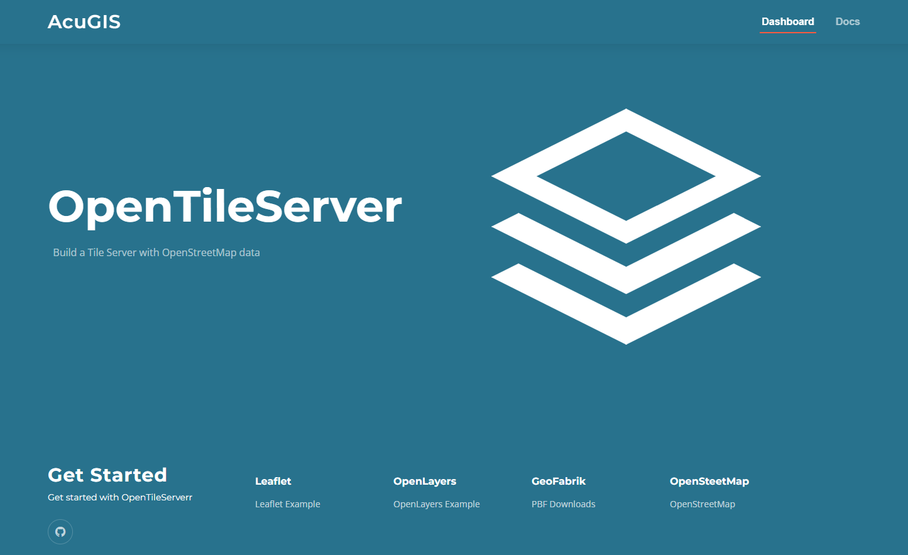

Installation and Usage
===========================

This script is for building a basic tile server with OpenStreetMap data.

For us only on a clean Ubuntu 20 install.

Be sure to review the "Using SSL" section below if you plan to enable SSL.

Installation
------------

Step 1: Get opentileserver.sh script from GitHub::

    wget https://raw.githubusercontent.com/AcuGIS/OpenTileServer/master/opentileserver-ubuntu-20.sh

Step 2: Make it executable::

    $ chmod 755 opentileserver-ubuntu-20.sh

Step 3 (for non-Latin alphabet)

If using a non-Latin alphabet, ucomment line 24 below if needed::

    $ export LC_ALL=C

Step 4: Run the script::

$ ./opentileserver-ubuntu-20.sh  [web|ssl] [bright|carto] pbf_url

Options
-------   
    
::

    [web|ssl]: 'web' for http and 'ssl' for https
    [bright|carto]: 'carto' for openstreetmap-carto or 'bright' for openstreetmap-bright
    pbf_url: Complete PBF url from GeoFabrik (or other source)

Examples
-----------

Load Delaware data with openstreetmap-carto style and no SSL::

    $ ./opentileserver-ubuntu-20.sh web carto http://download.geofabrik.de/north-america/us/delaware-latest.osm.pbf 

Load Bulgaria data with openstreetmap-bright style and SSL::
    
    $ ./opentileserver-ubuntu-20.sh http://download.geofabrik.de/europe/bulgaria-latest.osm.pbf bright

Load South America data with openstreetmap-carto style and SSL::

    $ ./opentileserver-ubuntu-20.sh ssl carto http://download.geofabrik.de/south-america-latest.osm.pbf

Using SSL
-----------------

If you select the ssl option and wish to use LetsEncrypt, be sure to do the following:

1.  Check hostname is set properly.  You can set the hostname using hostnamectl as below::

       hostnamectl set-hostname domain.com

2.  Run the script, which will provision a dummy SSL certificate.

3.  Once script completes, enable Python Certbot Apache plugin::

       apt-get -y install python3-certbot-apache

4.  Request a certificate using below::

       certbot --apache --agree-tos --email hostmaster@domain.com --no-eff-email -d domain.com

5. select the option "2: Redirect - Make all requests redirect to secure HTTPS access"::
   
6. Restart Apache

Welcome Page
------------

Once installation completes, navigate to the IP or hostname of your server.

You should see a page as below:

Click on both the OpenLayer and Leaflet Examples and check your installation is rendering

Note: Zoom is automatically set on the leaflet demo application.  On the OpenLayers demo application you will need to zoom to the area.

Produced by AcuGIS 

https://www.acugis.com/opentileserver

Cited, Inc. 

Wilmington, Delaware

https://citedcorp.com

Contribute
----------

- Issue Tracker: github.com/AcuGIS/OpenTileServer/issues
- Source Code: github.com/AcuGIS/OpenTileServer

Support
-------

If you are having issues, please let us know.
We have a mailing list located at: project@google-groups.com

License
-------

The project is licensed under the BSD license.
